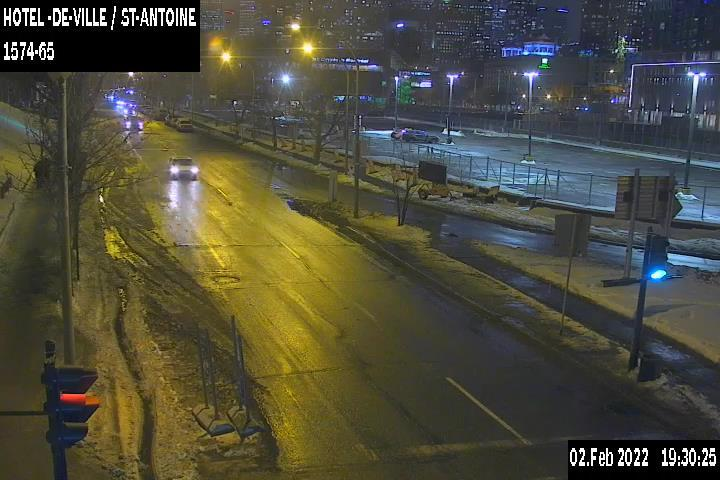
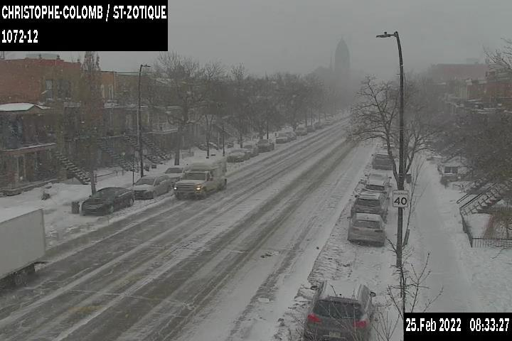
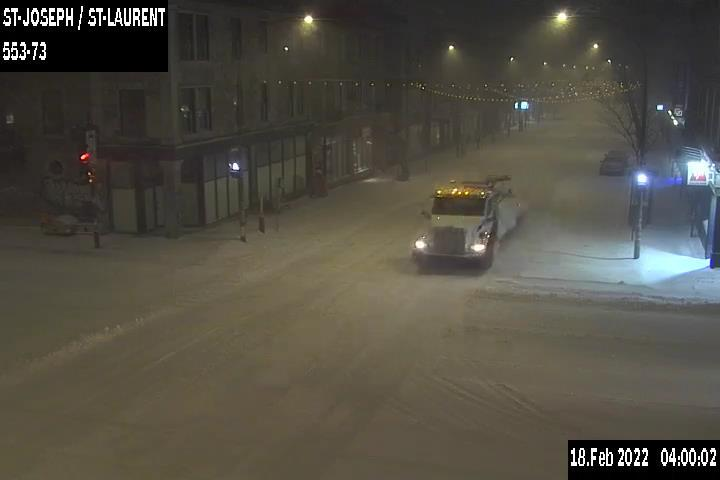
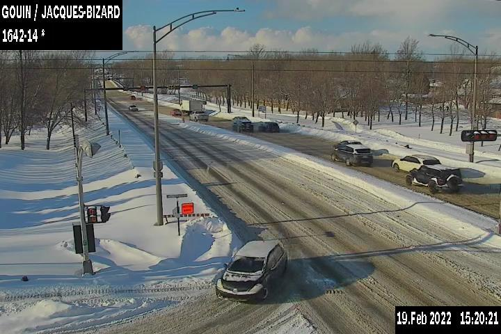
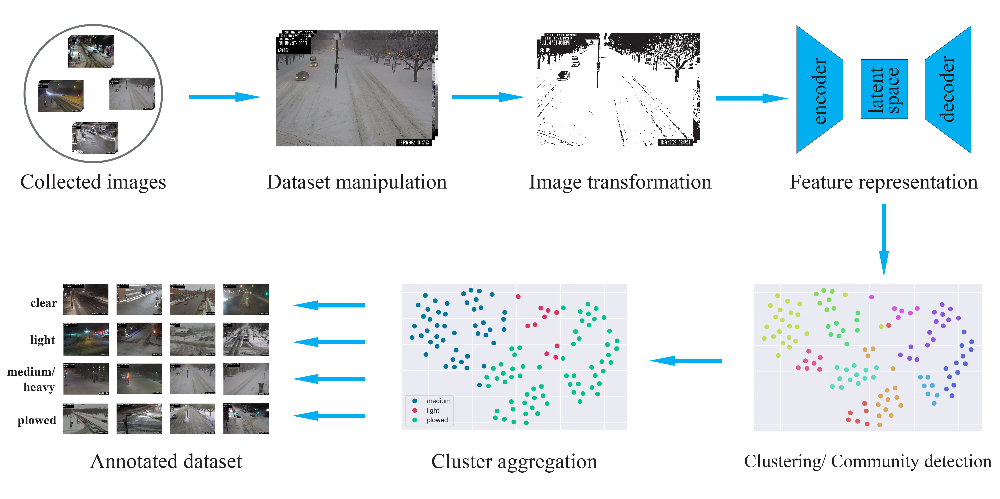

# Snow-Covered Roads Classification Image Dataset
This dataset is the result of the work developed in the paper:

An Automated Dataset Annotation Framework for Snow-covered Road Surface Classification, M. Karaa, H. Ghazzai, L. Sboui, H. Besbes and Y. Messoud.

## Description
This dataset is dedicated for snow-covered roads classification. It includes over 40000 annotated images describing four different road cover states. All images are collected in Montreal City, Quebec, Canada during the 2022 winter season. Images are captured by traffic monitoring cameras that installed in various road intersections around the city. These cameras are publicly avaible via the Montreal city [website](https://ville.montreal.qc.ca/circulation/).
The Dataset defines four classes according to their visual characteristics and that are aligned with snow removal operation performed in Montreal. Examples of each class are illusrated below.
<!--          |   |    |    -->
:-------------------------:|:-------------------------:|:-------------------------:|:-------------------------:
*Clear surface* |  *Light-covered surface* | *Medium-to-heavy-covered surface* | *Plowed surface*
## Dataset Aqcuisition
All images in this dataset are captured in the 2022 winter season during the period ranging from 30th January to 25th February. Image are automatically scraped in a discontinuous periods. The acquisition process targets multiple weather conditions (clear, rainy, snowy) in both day and night.
In addition to images, we collect weather information from [OpenWeatherMap](https://openweathermap.org/api) to log weather description and the amount of snow precipitation. Also, each image has a timestamp indicating its acquisition moment and period (day, night, twilight).
## Dataset Annotation
To annotate the dataset, we developed an automated dataset annotation framework that relies on image processing, unsupervised learning and clustering. The annotation process is depicted in the following figure.

